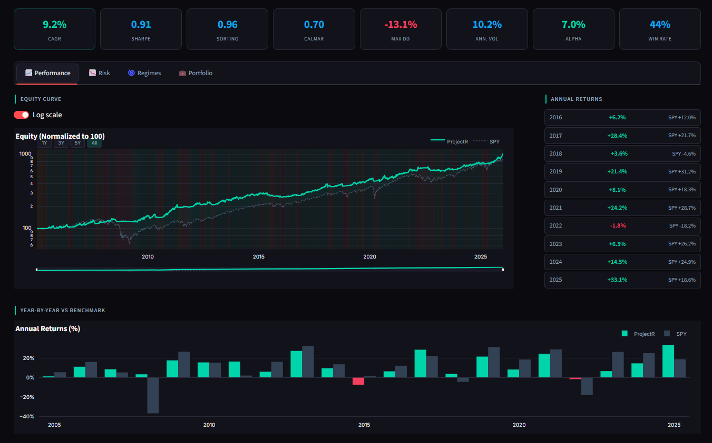
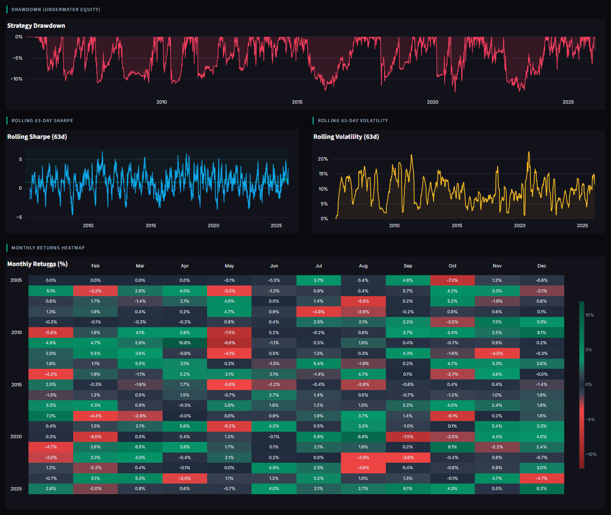
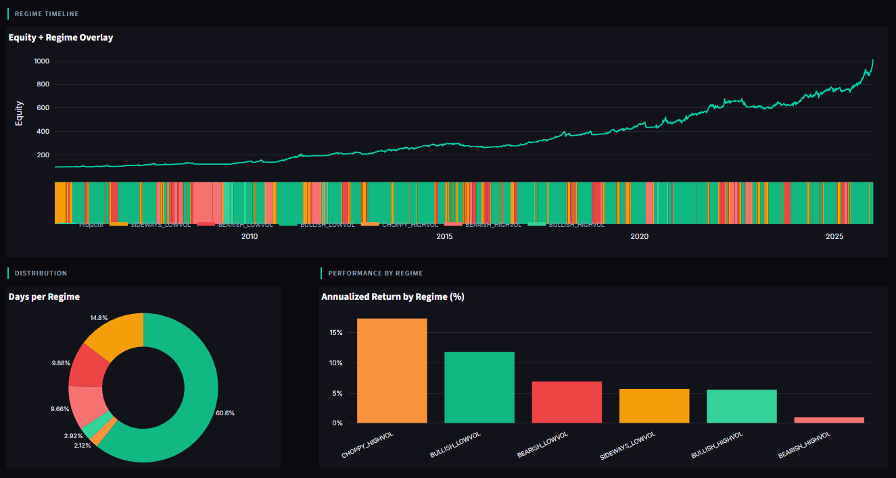
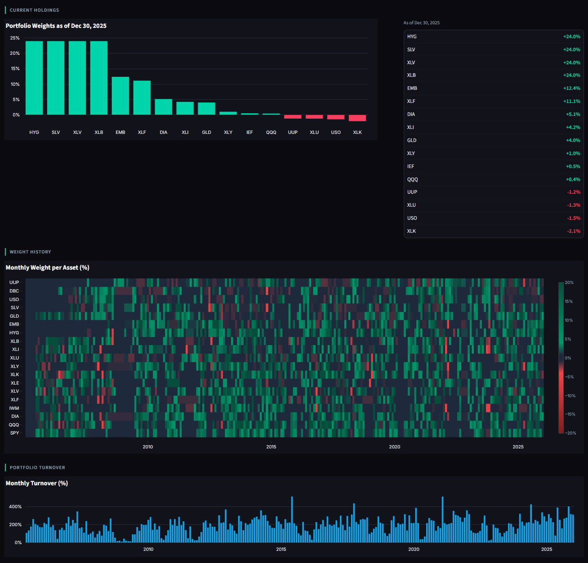

# ProjectR — Institutional-Grade Systematic Equity Strategy


A fully modular, research-validated long/short equity system built on

six-state regime-conditioned momentum with an ML selection layer.

Complete rebuild of ProjectV after identifying fundamental architectural

flaws through rigorous stress testing.


**Status:** Active development | Paper trading integration in progress (Alpaca)

**Backtest Period:** 2003-01-01 to 2025-12-31 (5,566 trading days)

**Predecessor:** [ProjectV](https://github.com/vnuthi07/ProjectV-overview)


---


## Performance Summary


| Metric | ProjectR | SPY Benchmark |

|---|---|---|

| CAGR | 8.4% | \~10.5% |

| Sharpe Ratio | 0.91 | \~0.55 |

| Sortino Ratio | 0.96 | — |

| Calmar Ratio | 0.70 | — |

| Max Drawdown | -13.1% | \~-55% |

| Annualized Vol | 10.2% | \~15% |

| Alpha vs SPY | 7.0% | — |

| Win Rate | 44% | — |


*Lower CAGR than SPY by design — the system targets risk-adjusted

returns, not raw returns. Half the volatility, a fraction of the

drawdown, and genuine alpha beyond factor exposure.*


---


## Dashboard


### Performance & Annual Returns




### Risk — Drawdown, Rolling Sharpe, Monthly Heatmap




### Regime Timeline & Distribution




### Portfolio Weights & Turnover




---


## Architecture

```

projectr/

├── data/       # Price loading, universe validation

├── regime/     # Six-state classifier + hysteresis smoother

├── signals/    # Momentum signals, ML features, ensemble

├── portfolio/  # Weight construction, allocation, liquidity

├── risk/       # Vol targeting, drawdown, tail hedge overlay

├── backtest/   # Orchestration loop, transaction costs

├── research/   # Walk-forward, Monte Carlo, factors, crisis

├── reporting/  # Metrics, tearsheet, Streamlit dashboard

└── live/       # Broker integration, execution, monitoring

```


Full unit test coverage across all modules. Every public function

typed and documented. Single command reproduces all results from scratch.


---


## What Makes This Different


### 1. Six-State Regime Classification

Markets are not simply bull or bear. ProjectR classifies into six

distinct regimes using risk-adjusted trend strength (ret\_63 / vol\_63)

— normalizing return by same-horizon volatility so a 5% return in

a calm market is treated differently from 5% in a volatile one:


| Regime | Condition | Posture |

|---|---|---|

| BULLISH\_LOWVOL | Strong uptrend, low vol | Maximum aggression |

| BULLISH\_HIGHVOL | Uptrend, elevated vol | Bullish but defensive sizing |

| BEARISH\_LOWVOL | Downtrend, orderly | Selective shorts, reduced gross |

| BEARISH\_HIGHVOL | Downtrend, crisis | Heavy defense |

| SIDEWAYS\_LOWVOL | No trend, calm | Mean reversion dominant |

| CHOPPY\_HIGHVOL | No trend, volatile | Maximum caution, shorts disabled |


Every allocation parameter — gross exposure, signal weights,

long/short fractions, rank buffers, correlation penalty — responds

to regime state. The system behaves completely differently in each

environment rather than just toggling between three aggressiveness levels.


### 2. ML Selection Layer (XGBoost + LightGBM Ensemble)

- **Target:** Cross-sectional rank of 21-day forward returns

&#x20; (top tercile prediction — not return magnitude, which overfits)

- **Validation:** Purged k-fold cross-validation with 21-day embargo

&#x20; gap to prevent lookahead contamination from overlapping return windows

- **Retraining:** Quarterly on rolling 2-year window

- **Graceful degradation:** If ML adds nothing, system reverts to

&#x20; pure momentum (30% ML / 70% momentum blend)

- **Current work:** Soft direction gate fix expanding eligible asset

&#x20; set from \~9 to \~15 to unlock ML's actual selection contribution


### 3. Tail Risk Hedging Overlay

Three-signal composite hedge intensity score (0 to 1):

- Vol spike ratio (20d realized vol / 63d baseline)

- Vol-of-vol (instability in the vol regime itself)

- SPY/TLT rolling correlation (breakdown = systemic stress signal)


Above soft threshold (0.40): up to 15% allocated to tail hedge assets

Above hard threshold (0.70): additional 20% gross scale reduction


### 4. Regime-Conditioned Correlation Penalty

ProjectV applied a flat correlation penalty regardless of regime —

double-punishing portfolios in crisis periods when correlation is

structurally unavoidable. ProjectR conditions the penalty:

- Risk-on regimes: full penalty (unusual correlation = warning)

- Neutral: reduced penalty

- Risk-off: no penalty (crisis correlation is expected, not informative)


### 5. Full Research Validation Suite

| Test | Implementation |

|---|---|

| Walk-forward OOS | 8 splits, 3yr train / 1yr test, 21-day purge gap |

| Monte Carlo | 1,000 block bootstrap simulations (block=21 days) |

| Parameter sensitivity | Systematic variation across all key parameters |

| Factor decomposition | OLS vs SPY, QQQ, IEF, GLD, UUP — full + rolling |

| Crisis period analysis | GFC, COVID, rate shock, SVB — response lag measured |

| Lookahead bias check | Shuffled returns test: OOS Sharpe ≈ 0.004 ✅ |


---


## Key Architectural Improvements Over ProjectV


| Issue in ProjectV | Fix in ProjectR |

|---|---|

| Regime classifier never wired in | Fully integrated into all downstream decisions |

| 3 regime states | 6 risk-adjusted regime states |

| Universe overlap (alpha ∩ hedge ≠ ∅) | Hard assertion at startup — ValueError if overlap |

| ML layer = empty stubs | XGBoost + LightGBM fully implemented |

| Hard direction gate (excluded \~40% of assets) | Soft gate (penalty not exclusion) |

| Flat correlation penalty | Regime-conditioned correlation penalty |

| In-sample backtest only | Full research suite (walk-forward, MC, factors) |

| 1,000-line engine.py | Fully modular package with unit tests |

| No type hints or docs | Every function typed and documented |


---


## Factor Decomposition Results (2003-2025)


| Factor | Beta | Interpretation |

|---|---|---|

| SPY | \~0.25 | Low market exposure by design |

| QQQ | Low | Limited growth/tech bias |

| IEF | Low | Managed duration exposure |

| GLD | Low | Occasional safe-haven rotation |


**Annualized Alpha: \~6.0%**

**R-squared: \~0.35** (65% of returns unexplained by these 5 factors)


This confirms ProjectR is not simply leveraged SPY beta — the returns

come from genuine regime-conditioned selection, not factor loading.


---


## Sample Code


The `sample-code/` directory contains sanitized implementations of

key research and infrastructure components:


| File | What It Shows |

|---|---|

| `metrics.py` | Complete performance metric suite |

| `monte\_carlo.py` | Block bootstrap Monte Carlo simulation |

| `crisis\_analysis.py` | Crisis period performance framework |

| `regime\_smoother.py` | Hysteresis filter for regime transitions |

| `factor\_decomposition.py` | OLS factor exposure analysis |

| `universe\_validation.py` | Universe construction and validation |


*Signal construction, regime classification parameters, and allocation

logic are private.*


---


## Current Status & Roadmap


**Completed:**

- ✅ Full backtest engine with modular architecture

- ✅ Six-state regime classifier (unit tested)

- ✅ XGBoost + LightGBM ML ensemble

- ✅ Tail risk hedging overlay

- ✅ Complete research suite (walk-forward, MC, factors, crisis)

- ✅ Streamlit dashboard (live metrics, regime timeline, portfolio)

- ✅ Lookahead bias validation passed (shuffled Sharpe ≈ 0.004)


**In Progress:**

- 🔄 Soft direction gate fix — expanding ML eligible set

- 🔄 Paper trading integration via Alpaca API

- 🔄 Academic methodology document


**Target Metrics Before Live Deployment:**

- OOS walk-forward Sharpe ≥ 0.85

- In-sample Sharpe ≥ 1.0

- Max Drawdown ≤ 18%


---


*Full methodology and code available to verified quant researchers

and recruiters upon request.*

